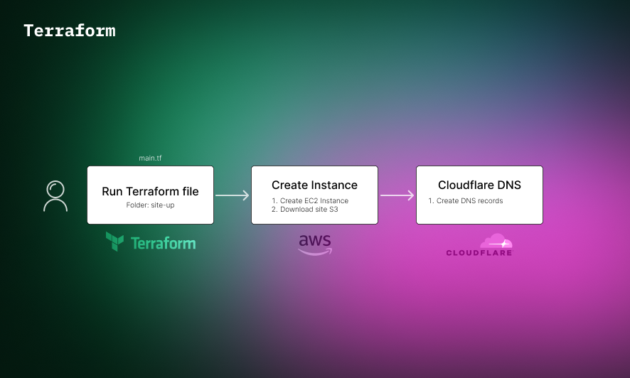
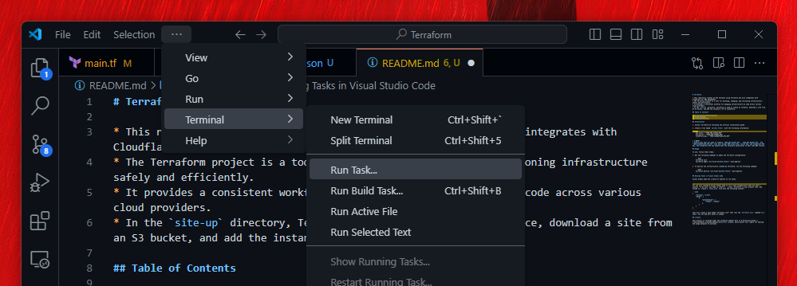

* This repository creates an EC2 Instance using Terraform and also integrates with Cloudflare for DNS management.
* The Terraform project is a tool for building, changing, and versioning infrastructure safely and efficiently.
* It provides a consistent workflow for managing infrastructure as code across various cloud providers.
* In the `site-up` directory, Terraform is used to create an instance, download a site from an S3 bucket, and add the instance's IP to Cloudflare.

## Table of Contents

- [Installation](#installation)
- [Usage](#usage)
- [License](#license)

## Installation

1. Install Terraform by following the official installation guide.

2. Create a file named `secrets.tfvars` with the following information:

    ```tfvars
    aws_acces = "YOUR_AWS_ACCESS_KEY"
    aws_secret = "YOUR_AWS_SECRET_KEY"
    cloudflare_api = "YOUR_CLOUADFLARE_API_KEY"
    ```

> [!NOTE]  
> Please note that you need to replace `YOUR_AWS_ACCESS_KEY`, `YOUR_AWS_SECRET_KEY`, and `YOUR_CLOUADFLARE_API_KEY` with your actual AWS access key, secret key, and Cloudflare API key. The Cloudflare API key should have the necessary permissions to edit zone DNS records.

## Usage

To use, follow these steps:

1. Run the following commands to apply the Terraform configuration:

    ```bash
    terraform init
    terraform apply -var-file="secrets.tfvars" -auto-approve
    ```

2. To destroy the infrastructure created by Terraform, run the following command:

    ```bash
    terraform destroy -var-file="secrets.tfvars" -auto-approve
    ```

## Running Tasks in Visual Studio Code

Visual Studio Code has a built-in feature to run tasks.



You can also configure Visual Studio Code to run a task automatically when you open a project.

```json
{
    "version": "2.0.0",
    "tasks": [
        {
            "presentation": {
                "reveal": "always"
            },
        }
    ]
}
```

## License

This project is licensed under the [Creative Commons Zero v1.0 Universal](https://creativecommons.org/publicdomain/zero/1.0/) license, which grants full rights for editing and usage purposes to everyone.
